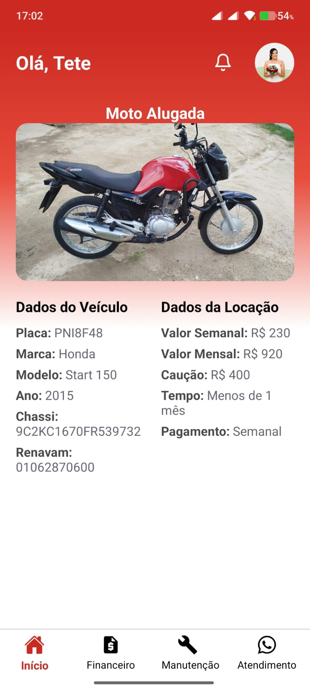
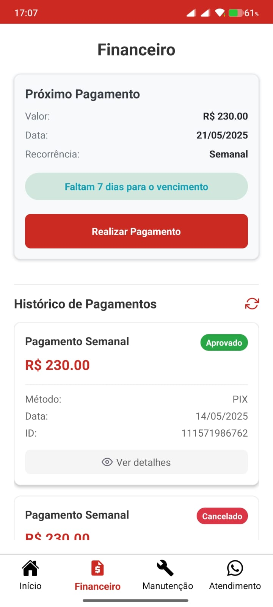
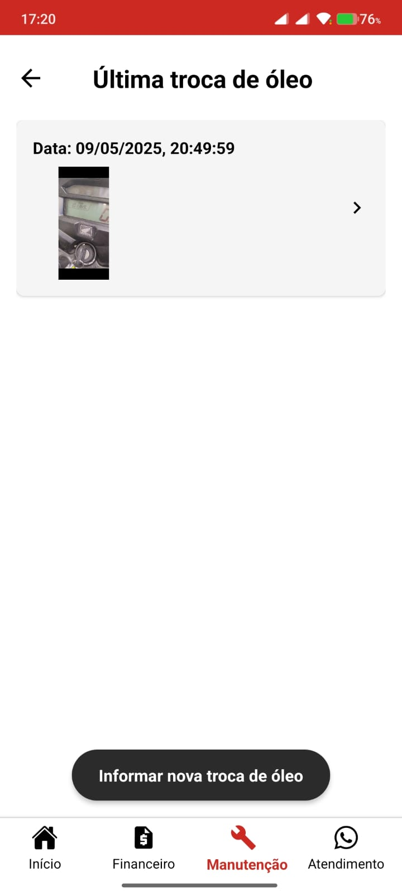
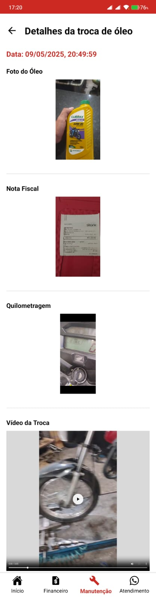
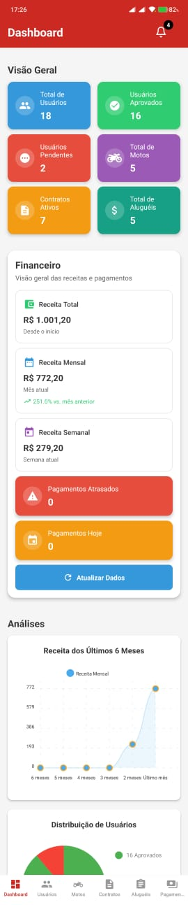
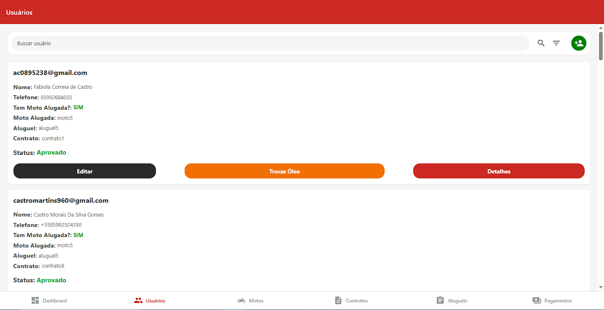
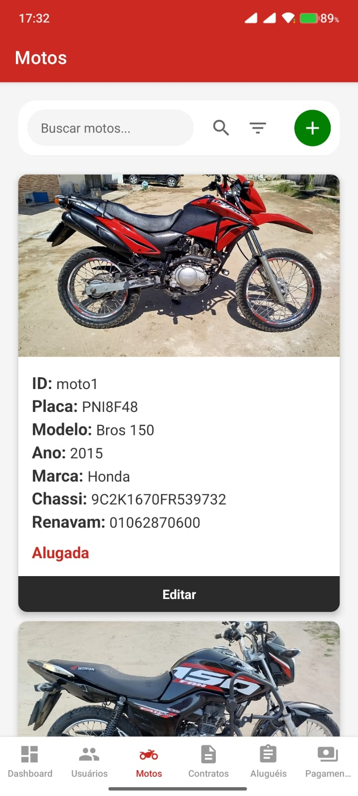
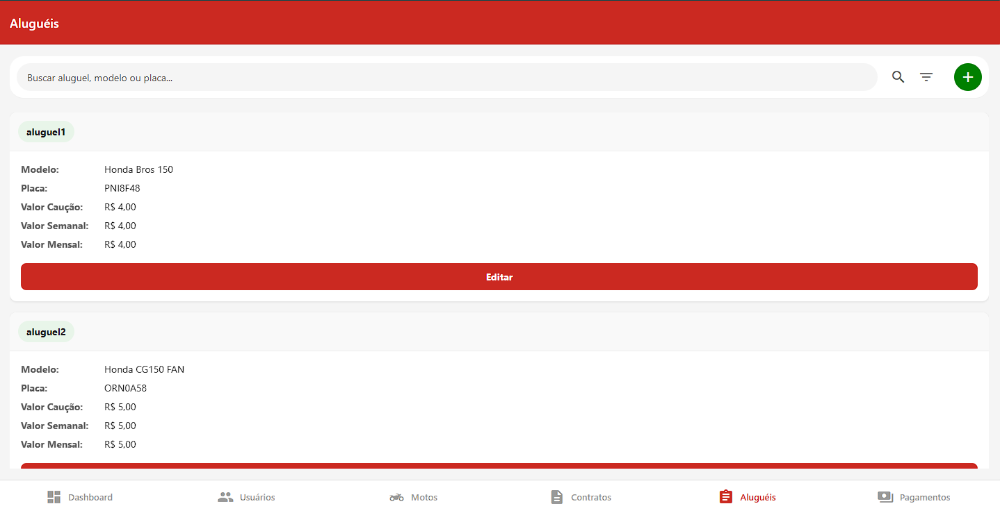
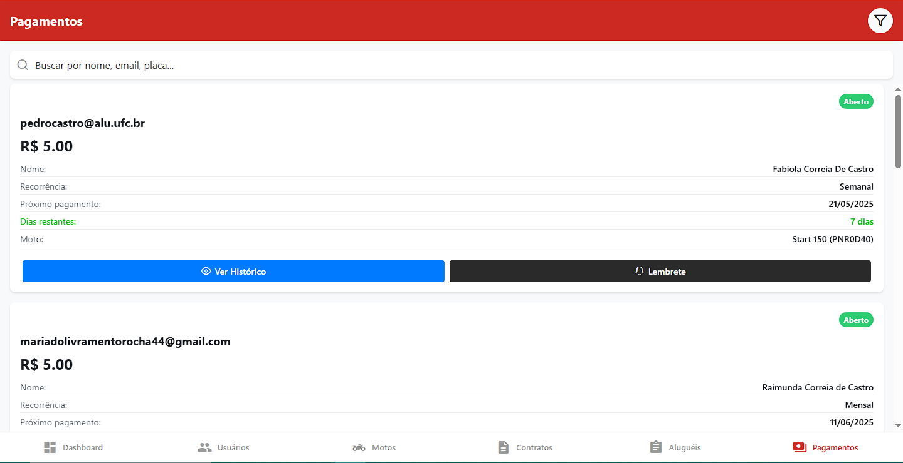

# Papa Tango - Aluguel de Motos

<p align="center">
  
</p>

<p align="center">
  <a href="#visão-geral">Visão Geral</a> •
  <a href="#funcionalidades">Funcionalidades</a> •
  <a href="#screenshots">Screenshots</a> •
  <a href="#tecnologias">Tecnologias</a> •
  <a href="#estrutura-do-projeto">Estrutura do Projeto</a> •
  <a href="#instalação">Instalação</a> •
  <a href="#configuração-do-firebase">Configuração do Firebase</a> •
  <a href="#configuração-do-mercado-pago">Configuração do Mercado Pago</a> •
  <a href="#execução">Execução</a> •
  <a href="#deploy">Deploy</a> •
  <a href="#politica-de-privacidade">Política de Privacidade</a> •
  <a href="#atualizações">Atualizações</a> •
  <a href="#licença">Licença</a> •
  <a href="#contato">Contato</a>
</p>

## Visão Geral

Papa Tango é uma aplicação multiplataforma desenvolvida com React Native e Expo que oferece um serviço completo de aluguel de motocicletas. O aplicativo funciona em dispositivos Android, iOS e navegadores web, com interfaces adaptadas para cada plataforma.

O sistema possui duas áreas principais:
- **Área do Cliente**: Permite aos usuários visualizar motos disponíveis, realizar cadastro, acompanhar informações da sua locação da moto, informar troca de óleo, contato facilitado com a empresa e efetuar pagamentos.
- **Área Administrativa**: Oferece ferramentas para gerenciamento completo de frota, usuários, contratos e pagamentos.

A aplicação é integrada com Firebase para autenticação, armazenamento de dados e funções de back-end, além de utilizar a API do Mercado Pago para processamento de pagamentos.

## Funcionalidades

### Para Usuários
- 👤 **Cadastro e Autenticação**: Sistema completo de registro e login de usuários
- 📝 **Perfil do Usuário**: Gerenciamento de informações pessoais e documentos
- 📅 **Solicitação de Aluguel**: Interface para solicitar o aluguel de motocicletas
- 💰 **Pagamentos**: Integração com Mercado Pago para pagamentos via PIX e boleto
- 🔔 **Notificações**: Sistema de notificações push para atualizações importantes
- 📱 **Multiplataforma**: Experiência adaptada para dispositivos móveis e web

### Para Administradores
- 🏢 **Dashboard Administrativo**: Visão geral das operações e métricas
- 🏍️ **Gerenciamento de Frota**: Cadastro, edição e remoção de motocicletas
- 👥 **Gerenciamento de Usuários**: Controle de cadastros e permissões
- 📄 **Gerenciamento Alugueis**: Cadastro, edição e remoção de alugueis
- 📊 **Controle de Contratos**: Acompanhamento de contratos ativos e histórico
- 💵 **Gestão de Pagamentos**: Monitoramento de pagamentos e faturamento
- 📨 **Sistema de Comunicação**: Envio de notificações e mensagens aos usuários
- 📊 **Relatórios**: Geração de relatórios e estatísticas de uso

## Screenshots

### Área do Cliente

<details>
<summary><b>Clique para ver screenshots da área do cliente</b></summary>

<div align="center">
  <p><strong>Landing Page</strong></p>
  
</div>

<div align="center">
  <p><strong>Login</strong></p>
  
</div>

<div align="center">
  <p><strong>Tela Home</strong></p>
  
</div>

<div align="center">
  <p><strong>Modal de Notificações</strong></p>
  
</div>

<div align="center">
  <p><strong>Área do Usuário</strong></p>
  
</div>

</details>

### Área Financeira

<details>
<summary><b>Clique para ver screenshots da área financeira</b></summary>

<div align="center">
  <p><strong>Tela Financeiro</strong></p>
  
</div>

<div align="center">
  <p><strong>Tela Financeiro (Etapa Pagamento)</strong></p>
  
</div>

<div align="center">
  <p><strong>Tela Financeiro (Detalhes do Pagamento - Aprovado)</strong></p>
  
</div>

<div align="center">
  <p><strong>Tela Financeiro (Detalhes do Pagamento - Pendente (Método PIX))</strong></p>
  
</div>

</details>

### Área de Manutenção

<details>
<summary><b>Clique para ver screenshots da área de manutenção</b></summary>

<div align="center">
  <p><strong>Tela Manutenção (Última(s) Trocas de óleo)</strong></p>
  
</div>

<div align="center">
  <p><strong>Tela Manutenção (Detalhes da Troca de Óleo)</strong></p>
  
</div>

</details>

### Área Administrativa

<details>
<summary><b>Clique para ver screenshots da área administrativa</b></summary>

<div align="center">
  <p><strong>Dashboard Administrativo</strong></p>
  
</div>

<div align="center">
  <p><strong>Gerenciamento de Usuários</strong></p>
  
</div>

<div align="center">
  <p><strong>Gerenciamento de Motos</strong></p>
  
</div>

<div align="center">
  <p><strong>Gerenciamento de Contratos</strong></p>
  
</div>

<div align="center">
  <p><strong>Gerenciamento de Alugueis</strong></p>
  
</div>

<div align="center">
  <p><strong>Gerenciamento de Pagamentos</strong></p>
  
</div>

</details>

## Tecnologias

### Front-end
- **[React Native](https://reactnative.dev/)**: Framework para desenvolvimento mobile multiplataforma
- **[Expo](https://expo.dev/)**: Plataforma para simplificar o desenvolvimento React Native
- **[React Navigation](https://reactnavigation.org/)**: Navegação entre telas
  - Bottom Tabs, Native Stack e Elements para diferentes tipos de navegação
- **[Styled Components](https://styled-components.com/)**: Estilização de componentes com CSS-in-JS
- **[Lottie](https://airbnb.io/lottie/)**: Animações de alta qualidade
  - Inclui lottie-react-native e @lottiefiles/dotlottie-react

### Back-end
- **[Firebase](https://firebase.google.com/)**:
  - Authentication: Autenticação de usuários
  - Firestore: Banco de dados NoSQL
  - Storage: Armazenamento de arquivos
  - Cloud Functions: Funções serverless para lógica de back-end
- **[Node.js](https://nodejs.org/)**: Ambiente de execução para as Cloud Functions

### Pagamentos
- **[Mercado Pago](https://www.mercadopago.com.br/developers/pt)**:
  - SDK React (@mercadopago/sdk-react)
  - API para processamento de pagamentos

### Armazenamento Local
- **[Async Storage](https://react-native-async-storage.github.io/async-storage/)**: Armazenamento persistente de dados no dispositivo

### Utilitários e Ferramentas
- **[Axios](https://axios-http.com/)**: Cliente HTTP para requisições à API
- **[Date-fns](https://date-fns.org/)**: Manipulação de datas
- **[Expo Camera](https://docs.expo.dev/versions/latest/sdk/camera/)**: Acesso à câmera do dispositivo
- **[Expo File System](https://docs.expo.dev/versions/latest/sdk/filesystem/)**: Manipulação de arquivos
- **[Expo Image Picker](https://docs.expo.dev/versions/latest/sdk/imagepicker/)**: Seleção de imagens da galeria
- **[Expo Notifications](https://docs.expo.dev/versions/latest/sdk/notifications/)**: Sistema de notificações push
- **[QRCode](https://www.npmjs.com/package/qrcode)**: Geração de códigos QR
- **[React Native Chart Kit](https://github.com/indiespirit/react-native-chart-kit)**: Criação de gráficos
- **[React Native Reanimated](https://docs.swmansion.com/react-native-reanimated/)**: Animações de alta performance
- **[React Native SVG](https://github.com/react-native-svg/react-native-svg)**: Suporte a SVG
- **[React Native WebView](https://github.com/react-native-webview/react-native-webview)**: Renderização de conteúdo web

## Estrutura do Projeto

```
app_papa_motos_expo/
├── functions/             # Cloud Functions do Firebase
├── src/
│   ├── animation/         # Animações do aplicativo
│   ├── assets/            # Recursos estáticos (imagens, ícones)
│   ├── components/        # Componentes reutilizáveis
│   ├── context/           # Contextos React (AuthContext, AdminContext)
│   ├── pages/             # Telas do aplicativo
│   │   ├── Admin/         # Área administrativa
│   │   ├── LandingPage/   # Página inicial
│   │   ├── Payment/       # Processamento de pagamentos
│   │   ├── SignIn/        # Login de usuários
│   │   └── ...            # Outras páginas
│   ├── routes/            # Configuração de navegação
│   └── services/          # Serviços (API, Firebase, notificações)
├── .env                   # Variáveis de ambiente (não versionado)
├── app.config.js          # Configuração do Expo
├── App.js                 # Componente principal
├── package.json           # Dependências do projeto
```

## Instalação

### Pré-requisitos
- [Node.js](https://nodejs.org/) (v14 ou superior)
- [Expo CLI](https://docs.expo.dev/get-started/installation/)
- [Firebase CLI](https://firebase.google.com/docs/cli) (para funções de back-end)
- [Git](https://git-scm.com/)

### Passos para instalação

1. Clone o repositório
```bash
git clone https://github.com/seu-usuario/app_papa_motos_expo.git
cd app_papa_motos_expo
```

2. Instale as dependências
```bash
npm install
```

3. Configure as variáveis de ambiente (veja a seção de Configuração do Firebase)

## Configuração do Firebase

Este aplicativo utiliza o Firebase para autenticação, banco de dados, armazenamento e notificações. Para executar o projeto localmente, você precisará configurar seu próprio projeto Firebase e adicionar os arquivos de configuração necessários.

### Passos para configuração:

1. Crie um projeto no [Firebase Console](https://console.firebase.google.com/)

2. Adicione 3 aplicações ao seu projeto Firebase:
   - Uma aplicação Android
   - Uma aplicação iOS
   - Uma aplicação Web

3. Baixe os arquivos de configuração:
   - Para Android: `google-services.json`
   - Para iOS: `GoogleService-Info.plist`

4. Coloque esses arquivos na raiz do projeto:
   ```
   app_papa_motos_expo/
   ├── google-services.json
   └── GoogleService-Info.plist
   ```

5. Crie um arquivo `.env` na raiz do projeto com as seguintes variáveis (substitua pelos valores do seu projeto Firebase):
   ```
   # Firebase Config
   FIREBASE_API_KEY=sua_api_key
   FIREBASE_AUTH_DOMAIN=seu_auth_domain
   FIREBASE_PROJECT_ID=seu_project_id
   FIREBASE_STORAGE_BUCKET=seu_storage_bucket
   FIREBASE_MESSAGING_SENDER_ID=seu_messaging_sender_id
   FIREBASE_APP_ID=seu_app_id
   FIREBASE_MEASUREMENT_ID=seu_measurement_id
   
   # Email Config
   EMAIL_USER=seu_email
   EMAIL_PASSWORD=sua_senha_de_app
   ```

6. Configure as regras de segurança no Firebase Console para Firestore, Storage e Realtime Database conforme necessário.

> **Nota importante**: Os arquivos `google-services.json`, `GoogleService-Info.plist` e `.env` contêm informações sensíveis e não devem ser compartilhados publicamente ou commitados no repositório.

### Configuração das Cloud Functions

Para configurar as Cloud Functions do Firebase:

1. Navegue até a pasta `functions`:
   ```bash
   cd functions
   ```

2. Instale as dependências:
   ```bash
   npm install
   ```

3. Crie um arquivo `env.json` com as configurações necessárias:
   ```json
   {
     "email": {
       "user": "seu_email@gmail.com",
       "password": "sua_senha_de_app"
     },
     "mercadopago": {
       "accessToken": "seu_token_mercado_pago",
       "webhookSecret": "seu_webhook_secret"
     }
   }
   ```

4. Crie um arquivo `service-account.json` com as credenciais de administrador do Firebase (pode ser baixado nas configurações do projeto no Firebase Console).

5. Implante as funções:
   ```bash
   firebase deploy --only functions
   ```

## Configuração do Mercado Pago

O aplicativo utiliza o Mercado Pago para processamento de pagamentos. Para configurar:

1. Crie uma conta no [Mercado Pago](https://www.mercadopago.com.br/)
2. Obtenha suas credenciais de acesso no [Dashboard de Desenvolvedores](https://www.mercadopago.com.br/developers/panel)
3. Configure o token de acesso nas Cloud Functions conforme mostrado na seção anterior

## Execução

### Desenvolvimento
```bash
# Iniciar o app em modo de desenvolvimento
npm start

# Iniciar o app para web
npm run web

# Iniciar o app para Android
npm run android

# Iniciar o app para iOS
npm run ios
```

### Produção
```bash
# Construir para web
expo build:web

# Construir para Android
eas build -p android

# Construir para iOS
eas build -p ios
```

## Deploy

### Web

#### Firebase Hosting (Recomendado)

1. Configure o Firebase Hosting:
   ```bash
   firebase init hosting
   ```

2. Construa o aplicativo web:
   ```bash
   expo build:web
   ```

3. Implante no Firebase Hosting:
   ```bash
   firebase deploy --only hosting
   ```

#### Alternativas Gratuitas
- **[Vercel](https://vercel.com/)**: Integração simples com GitHub
- **[Netlify](https://www.netlify.com/)**: Suporte a CI/CD automático
- **[GitHub Pages](https://pages.github.com/)**: Hospedagem direta do repositório

### Mobile

#### Google Play Store

1. Crie uma conta de desenvolvedor na [Google Play Console](https://play.google.com/console/)
2. Configure o app.json com as informações necessárias
3. Gere uma build de produção:
   ```bash
   eas build --platform android --profile production
   ```
4. Envie o arquivo AAB gerado para a Play Store

#### Apple App Store

1. Crie uma conta no [Apple Developer Program](https://developer.apple.com/programs/)
2. Configure o app.json com as informações necessárias
3. Gere uma build de produção:
   ```bash
   eas build --platform ios --profile production
   ```
4. Envie o arquivo IPA gerado para a App Store Connect

## Política de Privacidade

### Importância

A política de privacidade é **obrigatória** para publicação na Google Play Store e App Store, especialmente para aplicativos como o Papa Tango que:
- Coletam dados pessoais dos usuários (nome, email, CPF, telefone, endereço)
- Solicitam documentos sensíveis (CNH, RG, comprovante de endereço)
- Capturam imagens biométricas (selfie com CNH)
- Utilizam serviços do Firebase
- Solicitam permissões sensíveis (câmera, galeria, etc.)

### Implementação Recomendada

A forma mais simples e eficaz de implementar uma política de privacidade é através de uma página web hospedada no GitHub Pages:

1. **Criar um repositório dedicado no GitHub**:
   ```bash
   # Exemplo de nome para o repositório
   politica-privacidade-papa-tango
   ```

2. **Adicionar um arquivo HTML com a política de privacidade**:
   - Crie um arquivo `index.html` com o conteúdo completo da política
   - Inclua todos os dados coletados pelo aplicativo
   - Especifique como solicitar exclusão de dados (email/telefone de contato)

3. **Ativar o GitHub Pages**:
   - Nas configurações do repositório, ative o GitHub Pages
   - Selecione a branch principal como fonte
   - O GitHub fornecerá um URL (geralmente `https://seu-usuario.github.io/politica-privacidade-papa-tango`)

4. **Adicionar o link no aplicativo**:
   - Inclua um link para a política na tela de login ou cadastro
   - Exemplo de implementação:
   ```javascript
   <Text style={{ color: '#666', fontSize: 14 }}>
     Ao continuar, você concorda com nossa{' '}
     <Text 
       style={{ color: '#CB2921', textDecorationLine: 'underline' }}
       onPress={() => Linking.openURL('https://seu-usuario.github.io/politica-privacidade-papa-tango')}
     >
       Política de Privacidade
     </Text>
   </Text>
   ```

5. **Fornecer o URL na Play Store e App Store**:
   - Durante o processo de publicação, as lojas solicitarão o URL da política
   - Use o mesmo URL gerado pelo GitHub Pages

### Conteúdo Necessário

Para o Papa Tango, a política de privacidade deve mencionar explicitamente:

- **Dados coletados**: Nome, email, CPF, telefone, endereço, data de nascimento
- **Documentos**: CNH, RG, comprovante de endereço
- **Dados biométricos**: Selfie com CNH
- **Finalidade da coleta**: Verificação de identidade, processamento de aluguéis
- **Armazenamento**: Como e onde os dados são armazenados (Firebase)
- **Compartilhamento**: Esclarecer que os dados não são compartilhados com terceiros
- **Exclusão de dados**: Como solicitar a exclusão (email/telefone de contato)

### Vantagens do GitHub Pages

- **Gratuito**: Não há custos para hospedar a página
- **Confiável**: Alta disponibilidade garantida pelo GitHub
- **Fácil manutenção**: Atualizações simples via commits
- **Profissional**: URL limpo e apresentação adequada
- **Independente do app**: Atualizações na política não exigem nova versão do app

## Atualizações

### Atualizações OTA (Over-The-Air)

Com o Expo, você pode enviar atualizações de JavaScript sem precisar enviar uma nova versão para as lojas:

```bash
eas update --branch production --message "Descrição da atualização"
```

### Atualizações na Play Store/App Store

Para atualizar o aplicativo nas lojas:

1. Incremente a versão no app.config.js
2. Gere uma nova build com EAS Build
3. Envie a nova versão para as respectivas lojas
4. Aguarde o processo de revisão

## Dependências Principais

Aqui estão as principais dependências utilizadas no projeto:

### Navegação
```json
"@react-navigation/bottom-tabs": "^6.5.8",
"@react-navigation/elements": "^1.3.18",
"@react-navigation/native": "^6.1.7",
"@react-navigation/native-stack": "^6.9.13",
```

### UI e Componentes
```json
"@rneui/base": "^4.0.0-rc.7",
"@rneui/themed": "^4.0.0-rc.8",
"react-native-elements": "^3.4.3",
"react-native-paper": "^5.10.4",
"styled-components": "^6.0.7",
```

### Firebase
```json
"firebase": "^10.3.1",
"@firebase/app": "^0.9.19",
"@firebase/auth": "^1.3.0",
"@firebase/firestore": "^4.3.0",
"@firebase/storage": "^0.11.2",
```

### Expo
```json
"expo": "~49.0.11",
"expo-camera": "~13.4.4",
"expo-document-picker": "~11.5.4",
"expo-file-system": "~15.4.4",
"expo-image-picker": "~14.3.2",
"expo-linear-gradient": "~12.3.0",
"expo-notifications": "~0.20.1",
"expo-status-bar": "~1.6.0",
"expo-updates": "~0.18.13",
```

### Pagamentos
```json
"@mercadopago/sdk-react": "^0.0.15",
"mercadopago": "^1.5.17",
```

### Utilitários
```json
"axios": "^1.5.0",
"date-fns": "^2.30.0",
"dotenv": "^16.3.1",
"qrcode": "^1.5.3",
"react-native-chart-kit": "^6.12.0",
"react-native-masked-text": "^1.13.0",
"react-native-reanimated": "~3.3.0",
"react-native-svg": "13.9.0",
"react-native-webview": "13.2.2",
```

## Recursos e Funcionalidades Detalhadas

### Sistema de Notificações

O aplicativo utiliza o Expo Notifications para enviar notificações push aos usuários. As notificações são gerenciadas pelo serviço `notificationService.js` e incluem:

- Notificações de pagamento
- Comunicados importantes
- Promoções exclusivas
- Notificações de aniversário

### Processamento de Pagamentos

O sistema de pagamentos é integrado com o Mercado Pago e suporta:

- Pagamentos via PIX (com QR Code)
- Pagamentos via boleto bancário
- Histórico de transações
- Notificações automáticas de status

### Gerenciamento de Documentos

Os usuários podem enviar documentos necessários para o aluguel:

- CNH (Carteira Nacional de Habilitação)
- Comprovante de residência
- Selfie com documento
- Outros documentos solicitados

### Manutenção de Motos

O aplicativo inclui um sistema para registrar e acompanhar a manutenção das motocicletas:

- Registro de troca de óleo
- Acompanhamento de quilometragem

## Arquitetura do Projeto

O projeto segue uma arquitetura baseada em componentes com gerenciamento de estado via Context API:

- **AuthContext**: Gerencia a autenticação e informações do usuário
- **AdminContext**: Controla o estado e funcionalidades da área administrativa
- **Componentes Reutilizáveis**: Botões, inputs, cards e outros elementos de UI
- **Serviços**: Camada de abstração para comunicação com APIs e Firebase
- **Cloud Functions**: Lógica de back-end para operações complexas e seguras

## Contribuição

Contribuições são bem-vindas! Para contribuir:

1. Faça um fork do projeto
2. Crie uma branch para sua feature (`git checkout -b feature/AmazingFeature`)
3. Commit suas mudanças (`git commit -m 'Add some AmazingFeature'`)
4. Push para a branch (`git push origin feature/AmazingFeature`)
5. Abra um Pull Request

## Licença

Este projeto está licenciado sob a Licença MIT - veja o arquivo [LICENSE](LICENSE) para detalhes.

## Contato

Pedro Castro - [pedrohenriquecastro.martins@gmail.com](mailto:seu-email@exemplo.com)

- [GitHub](https://github.com/pedcastr)

- [LinkedIn](https://www.linkedin.com/in/pedro-castro-2504471b7/)

## Agradecimentos

- Minha esposa, por ter tido paciência e apoio durante o desenvolvimento deste projeto.
- [Expo Team](https://expo.dev/)
- [React Native Community](https://reactnative.dev/)
- [Firebase](https://firebase.google.com/)
- [Mercado Pago](https://www.mercadopago.com.br/)
- Todos os contribuidores e testadores do projeto

*Este projeto é proprietário e seu uso é restrito à Papa Tango.*
